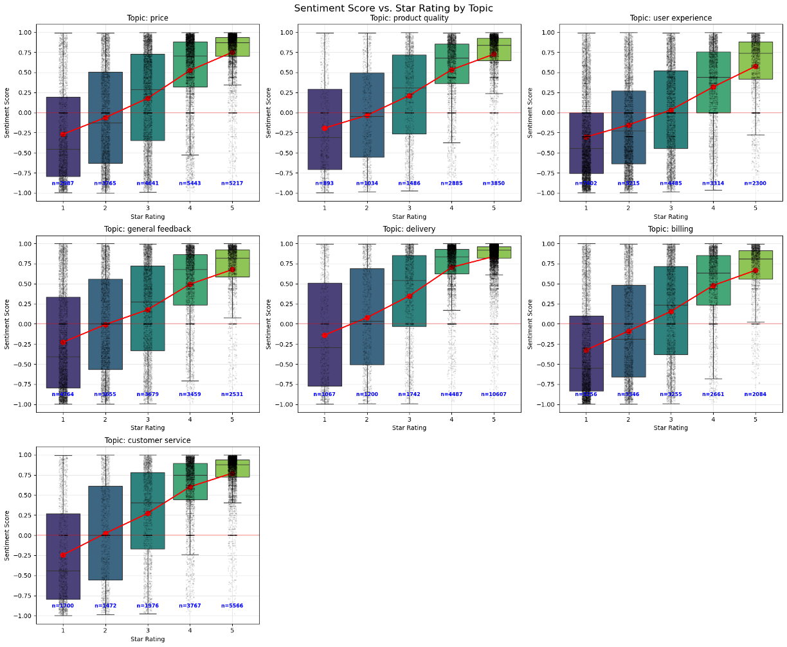
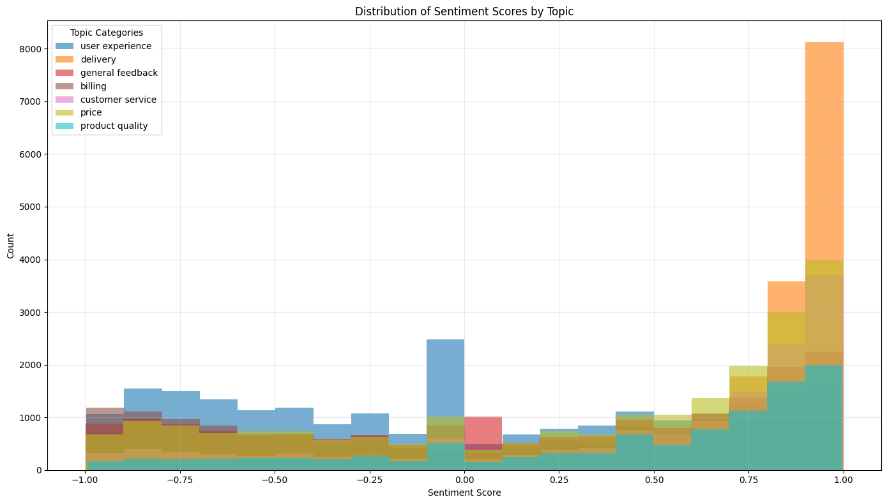

# Text Analyser

- [Description](#description)
- [Features](#features)
- [Technologies](#technologies)
  - [PySpark Implementation](#pyspark-implementation)
- [Key Findings](#key-findings)
  - [Topic-Sentiment Distribution](#topic-sentiment-distribution)
  - [Overall Sentiment Distribution](#overall-sentiment-distribution)
- [Technical Methodology](#technical-methodology)
  - [Machine Learning Approach](#machine-learning-approach)
  - [Topic Modeling with LDA](#topic-modeling-with-lda)
  - [Sentiment Analysis with VADER](#sentiment-analysis-with-vader)
  - [Pipeline Implementation](#pipeline-implementation)
  - [Alternative Approaches Considered](#alternative-approaches-considered)
- [Installation](#installation)
- [Usage](#usage)
- [Data](#data)
- [Development](#development)
  - [Setting up the development environment](#setting-up-the-development-environment)
  - [Building](#building)
  - [Committing changes](#committing-changes)
  - [Releasing](#releasing)
- [Configuration](#configuration)
- [License](#license)

## Description

This project aims to predict the sentiment of text and perform topic categorization. It analyzes customer reviews to extract valuable insights about sentiment patterns and key discussion topics. The analysis is based on Trustpilot reviews data with over 123,000 customer reviews across 22 business categories.

## Features

- Sentiment analysis using VADER
- Topic modeling with Latent Dirichlet Allocation (LDA)
- Text preprocessing including tokenization and stopword removal
- Visualization of topic-sentiment relationships
- Distributed text processing with PySpark

## Technologies

### PySpark Implementation

This project leverages PySpark for efficient data processing in a local environment:

- **Local Spark Context**: Runs on a single machine for development and analysis
- **DataFrame API**: Used for structured data manipulation of customer reviews
- **ML Pipeline**: Implements machine learning workflows with Spark ML
- **Text Processing**: Utilizes Spark's text processing capabilities for tokenization and feature extraction
- **RDD Operations**: For custom transformations and exploratory data analysis
- **UDFs (User-Defined Functions)**: For custom sentiment analysis with VADER integration

The PySpark implementation enables efficient processing of the large Trustpilot dataset even on a local machine, with the flexibility to scale to a cluster if needed in the future.

## Key Findings

The analysis identified seven distinct topics in customer reviews:

- **Product Quality** - Discussion about quality, durability, and condition of products
- **Billing** - Comments related to payments, charges, refunds, and pricing
- **General Feedback** - Overall satisfaction and recommendations
- **User Experience** - Comments about ease of use, interface, and customer journey
- **Delivery** - Feedback on shipping, packaging, and timing
- **Customer Service** - Mentions of support quality and issue resolution
- **Price** - Specific discussion of cost and value

Sentiment analysis revealed that "Billing" topics have the highest average sentiment score, while "Product Quality" has the lowest, suggesting customers are most satisfied with payment processes but most critical about product quality issues.

### Topic-Sentiment Distribution


*Figure 1: Boxplot showing sentiment distribution across different topics*

### Overall Sentiment Distribution


*Figure 2: Histogram of sentiment scores across all customer reviews*

## Technical Methodology

### Machine Learning Approach

This project employs a combination of unsupervised and rule-based learning techniques to analyze customer reviews:

### Topic Modeling with LDA

The Latent Dirichlet Allocation (LDA) algorithm was selected as the primary topic modeling approach for several reasons:

- **Interpretable results**: LDA produces probability distributions over words for each topic, making it easier to interpret what each topic represents
- **Appropriate for text data**: Specifically designed for document collections and works well with sparse term-document matrices
- **Scalability**: Implementation through PySpark allows the model to handle large document collections efficiently
- **Soft clustering**: Documents can belong to multiple topics with different probabilities, reflecting the reality that customer reviews often cover multiple aspects

The LDA implementation uses a TF-IDF weighted document-term matrix to emphasize distinctive terms and reduce the importance of common words across all reviews.

### Sentiment Analysis with VADER

For sentiment analysis, we implemented the VADER (Valence Aware Dictionary and sEntiment Reasoner) approach because:

- **Domain suitability**: VADER is specifically tuned for social media and short-form text like reviews
- **Rule-based efficiency**: As a lexicon and rule-based model, it doesn't require training data, allowing immediate application
- **Nuance capture**: Beyond simple positive/negative classification, VADER captures sentiment intensity on a continuous scale (-1 to 1)
- **Contextual understanding**: Handles negations, intensifiers, and other linguistic constructs that affect sentiment

This approach produces a compound sentiment score that correlates well with the star ratings in the dataset, validating its effectiveness.

### Pipeline Implementation

The analysis pipeline is implemented using PySpark's ML library with these key components:

1. **Text preprocessing**: Tokenization, stopword removal, and normalization
2. **Feature extraction**: TF-IDF vectorization to create numerical representations of text
3. **Dimensionality reduction**: LDA for topic discovery (k=7 topics)
4. **Sentiment scoring**: VADER for sentiment analysis with fallback to lexicon-based approach
5. **Topic assignment**: Dominant topic extraction for each document

### Alternative Approaches Considered

Several alternative approaches were evaluated before selecting the final methodology:

1. **Supervised classification**: Training classifiers (SVM, Random Forest) for sentiment prediction was considered, but would have required labeled training data and might introduce biases from the labeling process.

2. **Word embeddings with clustering**: Word2Vec or GloVe embeddings with K-means clustering could provide more semantically nuanced topic representations but might be less interpretable than LDA's explicit word distributions.

3. **BERT-based approaches**: While fine-tuning BERT for sentiment analysis would likely improve accuracy, the computational requirements would be significantly higher and potentially unnecessary given VADER's strong performance for this application.

4. **Non-negative Matrix Factorization (NMF)**: This alternative topic modeling approach was considered, but LDA was preferred for its probabilistic foundation and natural handling of documents as mixtures of topics.

5. **Dynamic Topic Models**: For tracking topic evolution over time, but deemed unnecessary for this static analysis of reviews.

The chosen approach balances accuracy, interpretability, and computational efficiency, making it well-suited for extracting actionable insights from customer reviews at scale.

## Installation

Clone the repository:

```bash
git clone https://github.com/aaronginder/text-analyser.git
```

Install dependencies using Poetry:

```bash
poetry install
```

## Usage

The project includes a Jupyter notebook in the exploration directory that demonstrates the full analysis pipeline.

## Data

The project uses Trustpilot reviews data for training and evaluation, located in the data directory.

## Development

### Setting up the development environment

Install Poetry:

```bash
pip install poetry
```

Install dependencies:

```bash
poetry install
```

### Building

To build the project:

```bash
poetry build
```

### Committing changes

This project uses semantic-release to automate the release process. Follow the conventional commits specification for commit messages.

Example:

- `feat: add new sentiment analysis model`
- `fix: correct topic classification bug`
- `docs: update installation instructions`

### Releasing

Releases are automated using semantic-release based on commit messages. Merging to the main branch will trigger a release. The project supports different release branches:

- `main`: production releases
- `develop`: development releases
- `alpha`, `beta`, `rc`: prerelease versions

## Configuration

Configuration is managed via config.yml.

### License

This project is licensed under the MIT License - see the LICENSE file for details.